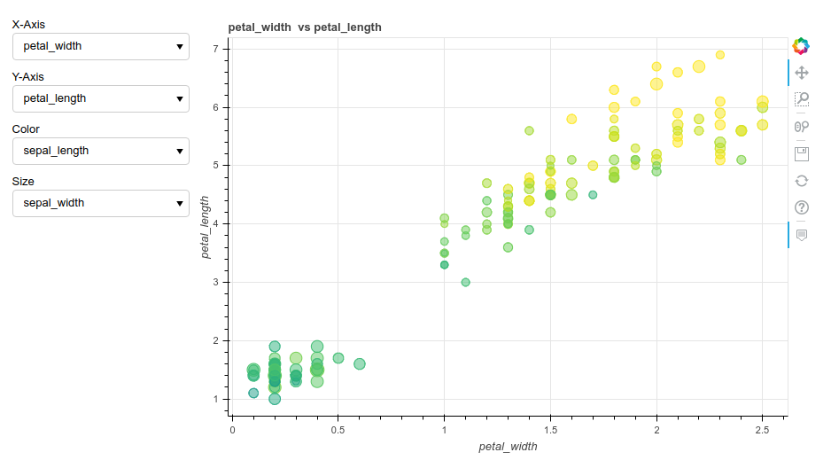

# Iris Dataset Explorer
Iris Dataset Explorer is a web application built with Python and Bokeh. It contains an interactive graphic which provide an easy exploration of the Iris Dataset. It's available [here](http://iris-explorer.herokuapp.com/).
